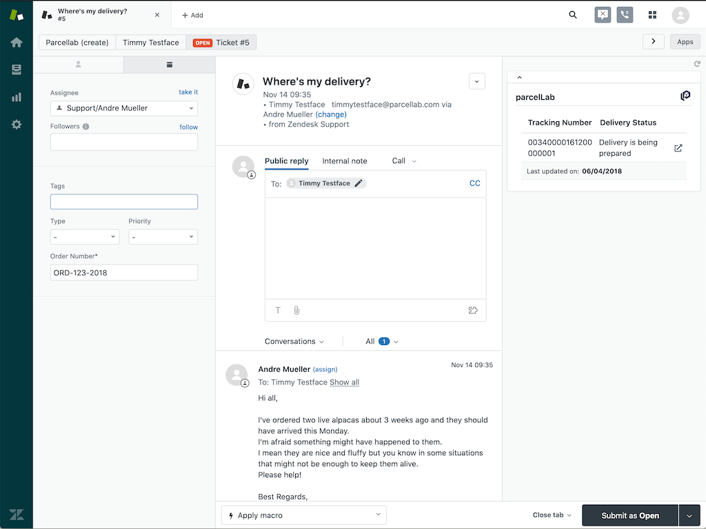

# parcellab-zendesk-app

[](https://github.com/parcelLab/parcellab-zendesk-app/actions)

A Zendesk ticket sidebar app to check order status via parcelLab API.
Project structure is based on [zendesk/app_scaffold](https://github.com/zendesk/app_scaffold).
This app is written in JavaScript and React.



## Support

If you have any specifc questions, please feel free to contact Andre ([hmmmsausages](https://github.com/hmmmsausages) / [andre@parcellab.com](mailto:andre@parcellab.com))

## Prerequisite

To successfully test the integration of this Zendesk app with a live Zendesk portal and package the Zendesk app for a production release, you will need the Zendesk app tools (`zat`), which is a CLI Ruby tool.

If you're on macOS you should already have Ruby installed by default, so all you need to do in that case is:

```bash
# Install rake, which is required by the Zendesk app tools
gem install rake
# Install the Zendesk app tools
gem install zendesk_app_tools
```

It's also worthwhile to check out the following resources, so you get an idea how the development lifecycle of a Zendesk app works:

- [https://develop.zendesk.com/hc/en-us/categories/360000003408-Zendesk-apps](https://develop.zendesk.com/hc/en-us/categories/360000003408-Zendesk-apps)

## How To Run This App Locally

To run the app locally executed the following steps:

```bash
# Install all node dependencies (in case it hasn't been done before)
npm install
# Compile and watch files with webpack and serve the app to your Zendesk instance with `?zat=true`
npm run dev
```

Edit `./settings.yml` to change the Zendesk app's test configuration settings. By default it is using the 'parcelFashion' userId and the ticket field ID for the 'order number' ticket field of the 'd3v-parcellab' Zendesk support board.

Then you can open up a browser, navigate to a ticket in Zendesk, ensure you have the above query parameter set in your browser's address bar. You should then see your app being served and any local changes will be automatically deployed. In most browsers you will need to explicitly allow loading unsafe scripts or mixed content (warning on the right side of the address bar), due to the way the integration with your local Zendesk app works.

## How To Run This App With Our Zendesk Test Account

We've been provided with a so called "sponsored" Zendesk account, which gives us the ability to test our Zendesk app in an actual Zendesk board, without the need for us to submit the app to the Zendesk marketplace.
To run the app within our Zendesk board do the following:

1. Within the project root folder, run `npm run dev`
1. Open up our Zendesk support board: [d3v-parcellab.zendesk.com](https://d3v-parcellab.zendesk.com) and logon with the login details stored in the "Shared-Dev" folder in LastPass.
1. Navigate to a support ticket and open it.
1. Edit the URL in the address bar and the query parameter `?zat=true`. This will tell Zendesk to serve any Zendesk apps coming from your local webserver that you started with `npm run dev`.
1. Allow loading unsafe scripts or mixed content (warning on the right side of your browser's address bar). This is necessary as the Zendesk app is trying to load scripts from your localhost via an unsafe HTTP connection.
1. You'll now be able to see your app running in the right sidebar of any ticket you're opening. Any code changes that you save locally will be hotloaded and can be accessed by reloading the sidebar apps or refreshing the page.

## How To Run The Tests

The app is using the [Jest testing framework](https://jestjs.io/), combined with the [testing-library / react-testing-library](https://testing-library.com/) extension.
To run the all tests, do the following:

```bash
# Install all node dependencies (in case it hasn't been done before)
npm install
# Execute all tests
npm test
```

## Compile The App For Production

The app needs to be build and packaged before it can be released on the Zendesk marketplace via the [Zendesk Developers portal](https://apps.zendesk.com/).
To build, validate and package the app do the following.
**Note**: Ensure your test are all passing before you package the app for a release.

```bash
# Install all node dependencies (in case it hasn't been done before)
npm install
# Create production build in folder ./dist
npm run build
# Validate the app against Zendesk's quality profile. If no errors or warnings are shown, the app should be releasable.
zat validate -p dist
# Package the app into a zip file and place it in `./dist/tmp/*`. The zip file can then be used to release the app in the Zendesk marketplace.
zat package -p dist
```

## General App Structure

**Note:** Zendesk enforces the mandatory existence of some files and their folder structure. This is mainly for I18N and Zendesk marketplace documentation purposes: Please see [developer.zendesk.com/apps/docs/developer-guide/setup#file-requirements](https://developer.zendesk.com/apps/docs/developer-guide/setup#file-requirements) for more information

- src: contains all Zendesk app Javascript & React source code
  - image: contains all images. *Note:* that some images are mandatory and required by Zendesk even though they're are not actively used in the source code
  - javascripts
    - lib: contains all non React helper functions
    - modules: contains all React components
  - templates: contains the iframe HTML base structure for the Zendesk app
  - translations: contains all language files for I18N. *Note:* `en.json` is mandatory
- spec: contains all Jest tests (unit/integration)
- webpack: contains webpack helper functions
